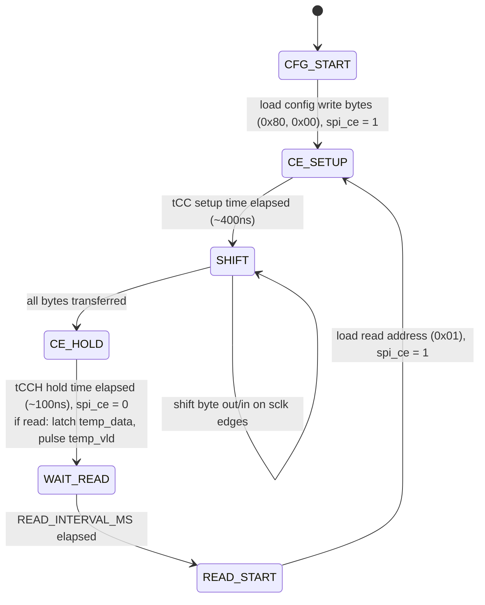

# max31723-spi-thermometer

FPGA project for the Digilent Zybo Z7 (Zynq-7000): a hand-written SPI
master in Verilog reading a MAX31723 digital thermometer, exposed as an
AXI-Lite IP and read out over the Zynq PS via C.

| File | Description |
|------|-------------|
| `tempsensor.v` | SPI master + MAX31723 driver |
| `myip_spi_ela_v1_0.v` | AXI wrapper top-level |
| `myip_spi_ela_v1_0_S00_AXI.v` | AXI-Lite register interface |
| `zybo_spi.xdc` | Pin constraints |
| `main.c` | Vitis/SDK app: reads temp, prints over UART |
| `tb_tempsensor.v` | Testbench + behavioral MAX31723 model |

## Protocol

MAX31723 communicates over SPI, Mode 1 (CPOL=0, CPHA=1), MSB-first.

- Config register (`0x80` write): SD=0 enables continuous conversion (device
  ships in shutdown mode by default).
- Temperature register (`0x01` read, burst LSB then MSB): 16-bit two's
  complement, 9-bit resolution by default.

## AXI register map (offset from IP base address)

| Offset | Name  | Access | Description |
|--------|-------|--------|-------------|
| 0x00   | TEMP_DATA | R  | Last read 16-bit temperature value ({MSB, LSB}). |
| 0x04   | STATUS    | R  | Bit 0: new data ready (cleared on read). |

## C usage

`main.c` polls the STATUS register; when new data is ready, it reads
TEMP_DATA, converts it (`signed_raw / 256.0`), and prints the temperature
over UART every ~100ms.

## Build

1. Package `tempsensor.v` inside the AXI-Lite wrapper (`myip_spi_ela`) and
   add it to the IP repository.
2. In a Block Design, instantiate the IP alongside the Zynq7 Processing
   System, run Block/Connection Automation, validate, create the HDL
   wrapper.
3. Apply `zybo_spi.xdc`, generate bitstream, export hardware with bitstream.
4. In Vitis/SDK, create a standalone application, add `main.c`, build and
   run on hardware.

## Hardware notes
## Results

Verified on hardware (Zybo Z7-10): the module correctly initializes the
MAX31723 (config write, SD=0), then reads back the temperature register
every ~1s and prints the converted value over UART via `main.c`. Confirmed
the reading responds correctly to real temperature changes — touching the
sensor with a warm or cold source produced a corresponding rise or drop in
the reported value.

Simulation waveform (below) confirm the same SPI timing and read sequence
in isolation, without requiring hardware:

- MAX31723 CE must be held high for the full transfer, with tCC (~400ns)
  setup before SCLK starts and tCCH (~100ns) hold after the last SCLK edge.
- SCLK kept at 4MHz (datasheet max 5MHz) for timing margin.

